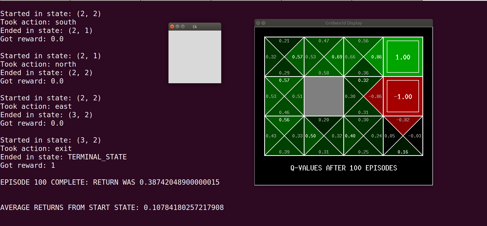
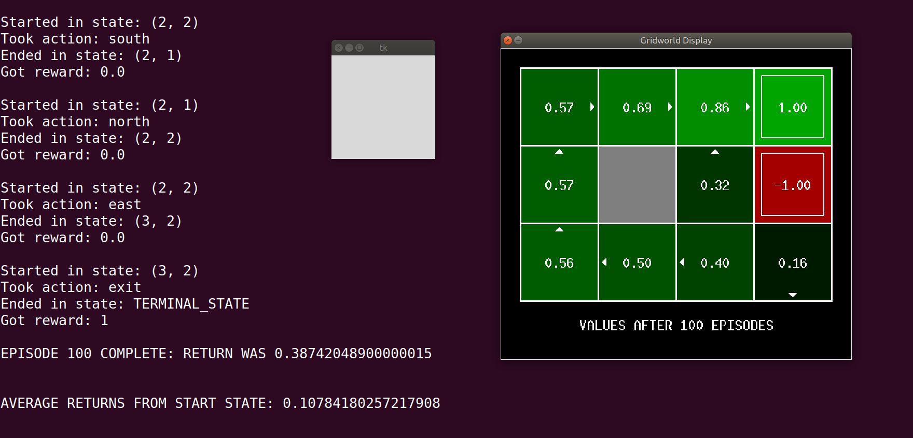

# rl-gridworld
[Simple tool to Visualize the Q-Learning](http://ai.berkeley.edu/reinforcement.html#Q4)

##How to run?

Press space at the end of the training to get to see the path directions.

```
python gridworld.py -h # to get help
python gridworld.py -k 10 -a q
python gridworld.py -k 10 -a q -s 4 # increase the speed
python gridworld.py -r -0.04 -k 100 -a q -s 20000 -d 0.5
```

`python gridworld.py -k 100 -a q -s 100 # increase the speed`






Solutions: 
- [https://github.com/srinadhu/RL_Pacman](https://github.com/srinadhu/RL_Pacman)
- [https://github.com/Jeff-sjtu/Pacman-CS188/blob/master/rl/qlearningAgents.py](https://github.com/Jeff-sjtu/Pacman-CS188/blob/master/rl/qlearningAgents.py)

Medium:
- [http://mnemstudio.org/path-finding-q-learning-tutorial.htm](http://mnemstudio.org/path-finding-q-learning-tutorial.htm)
- [https://towardsdatascience.com/implement-grid-world-with-q-learning-51151747b455](https://towardsdatascience.com/implement-grid-world-with-q-learning-51151747b455)

Courses:
- https://pooyanjamshidi.github.io/csce580/lectures/
- [Berkeley 2014](http://ai.berkeley.edu/reinforcement.html)
- [Berkeley 2014 Solution](https://github.com/Jeff-sjtu/Pacman-CS188/blob/master/rl/qlearningAgents.py)
- [Berkeley 2014 Solution1](https://github.com/ngbolin/PacManProjects)
- [Berkeley 2020](https://inst.eecs.berkeley.edu/~cs188/fa20/projects/)
- [Berkeley 2020 Solution](https://github.com/zhangjiedev/pacman)


**Python 2to3**
```
2to3 -W *.py
```

**Runtime Error**
- https://stackoverflow.com/questions/7714229/tkinter-woes-when-porting-2-x-code-to-3-x-tkinter-module-attribute-doesnt-ex
- https://stackoverflow.com/questions/28934079/substitute-for-tkinter-dooneevent
